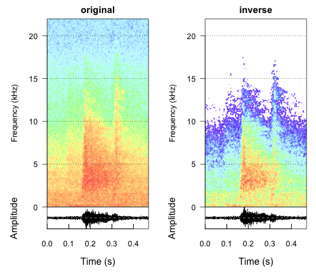

Software-based [active noise control](http://en.wikipedia.org/wiki/Active_noise_control) using your Mac's microphone and a set of plain earphones.

### Description

Theoretically, by taking real-time audio from a computer's microphone and emiting an attenuated sound wave with the same amplitude but with inverted phase, we can cause interference to cancel out unwanted noise.

The 2d-spectrographic below illustrate our recorded [10-second wav file](./data/ambience.wav) and produced an inverted wav file. When both files are played together, they cancel each other out.

### Credits

A Forward hackday project by [Max](https://github.com/maxdupenois), [Sid](https://github.com/sdawara), and [Paul](https://github.com/Quantisan).